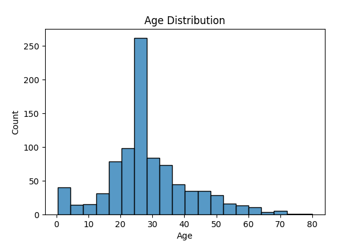
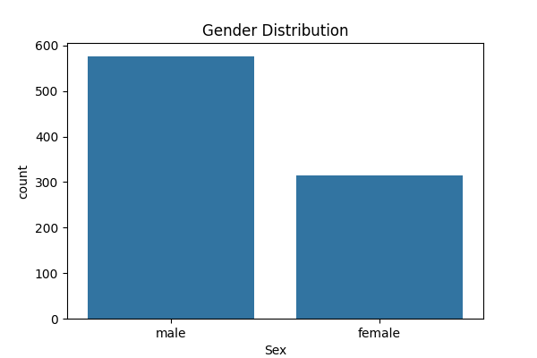

# Data Cleaning and Visualization Project

## Project Overview

This project demonstrates data cleaning, preprocessing, and visualization using Python.

The Titanic dataset was used to analyze passenger information and generate meaningful insights through visualizations.

## Technologies Used

- Python
- Pandas
- Matplotlib
- Seaborn

## Dataset

Titanic Passenger Dataset

## Project Tasks

- Handled missing values
- Removed duplicate records
- Cleaned and preprocessed data
- Generated visualizations
- Extracted insights from the dataset

## Files Included

- `data_cleaning.py` - Main Python script
- `titanic.csv` - Original dataset
- `cleaned_titanic.csv` - Processed dataset
- `survival_distribution.png`
- `age_distribution.png`
- `gender_distribution.png`

## Visualizations

### Survival Distribution

### Age Distribution

### Gender Distribution

## Key Insights

- More passengers died than survived.
- Most passengers belonged to the adult age group.
- Male passengers outnumbered female passengers.
- Data preprocessing improved dataset quality and usability.

## Outcome

Successfully performed data cleaning and visualization using Python data science libraries and generated meaningful insights from the Titanic dataset.
